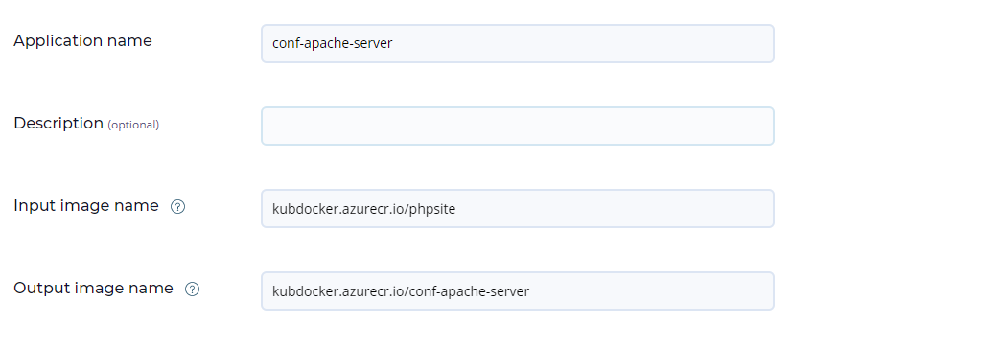
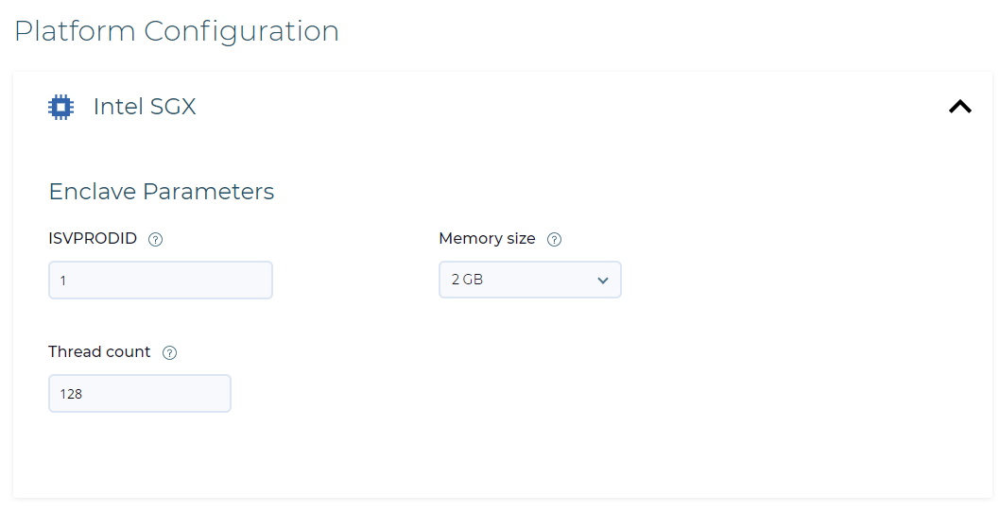
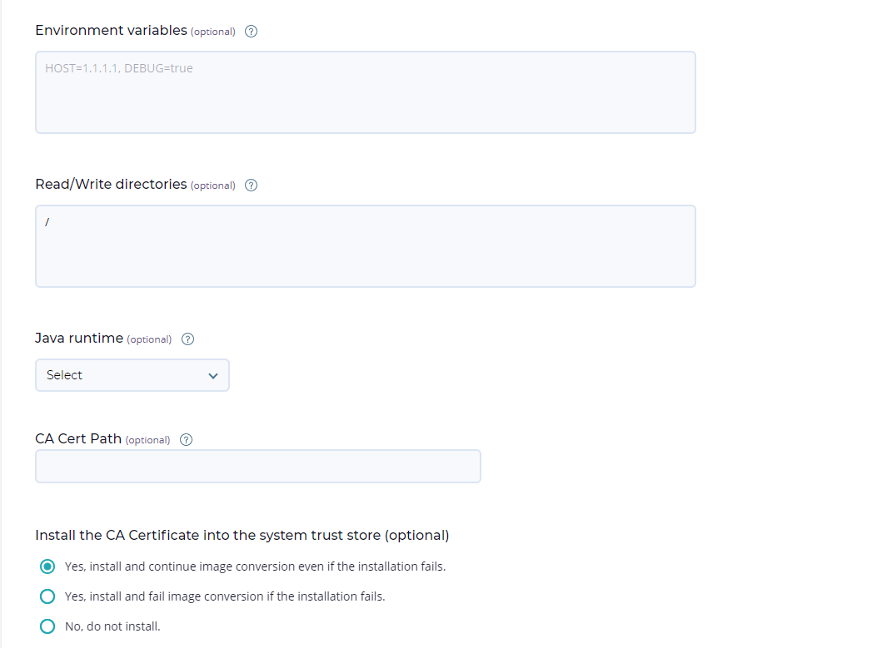
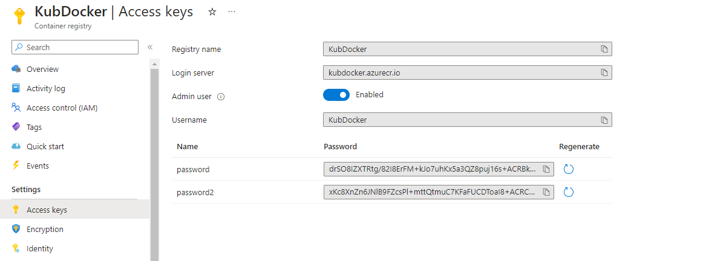
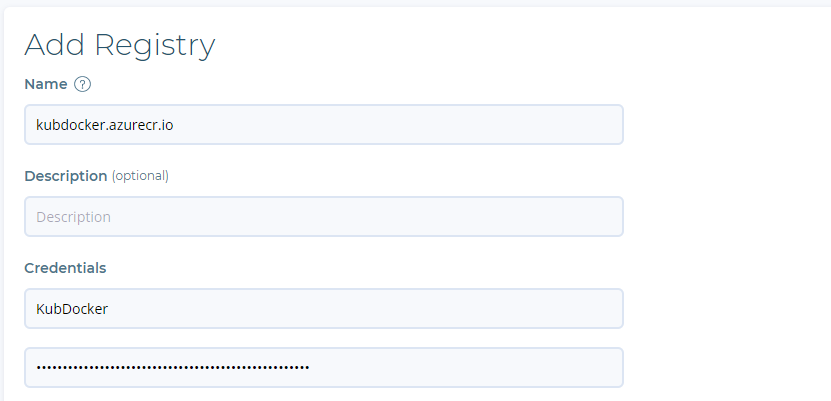

# Nødvendig Programvare:

* Mysql
* Git
* Terraform
* AzureCLI
* Kubectl

## <a name="nedlastningsguide"></a>Nedlastnings guide

Nødvendig programvare kan lastes ned ved å kjøre download.ps1 skriptet man finner under Dependencies mappen. Her er det verdt å nevne at innstallasjonen benytter seg av choco og er dermed laget for Windows brukere. Linux brukere må dermed få lastet ned pakkene på eget vis. 

# <a name="forutsetninger"></a>Forutsetninger i Azure
Produktet i denne oppgaven er satt opp i Azure. Dermed så er en avhengig av tilgang på et 'Azure Subscription' for å teste løsningen beskrevet under. Når det kommer til deployment av produktet vårt så tar en utgangspunkt i at en allerede har opprettet to 'Resource groups' en 'Storage Account' og ett 'Container Registry' i Azure. Her skal ressursgruppene skille mellom ressursene som opprettes i det konfidensielle miljøet og det ikke-konfidensielle miljøet som opprettes. Eneste ressursen som deles mellom miljøene vil være en "Storage Account" som bare brukes til å lagre state-filene til Terraform skriptene som brukes. Ressursen har dermed ingen påvirkning på miljøene som bygges annet enn at Terraform bruker ressursen som en disk til lagring av status på hvordan infrastrukturen ser ut idag. For å vite hvordan vi har satt opp backend til terraform så kan man se på alle .tfbackend filer. Disse beskriver hvordan Storage accounten er bygd. 'Container Registry' er en ressurs i Azure som kan sees på som en 'Storage Account' for Docker images. Hensikten med ressursen blir dermed å ta vare på Docker images slik at de kan brukes av andre resursser i Azure. I dette tilfellet så brukes registeret av Kubernetes Clusteret for å rulle ut webserveren vår.

# Fullstendig guide til oppsett av miljøene
Nedenfor har vi satt opp guide med oversikt over hva som må gjøres for å replikere miljøet vårt. Dermed er det viktig at man følger denne guiden ordentlig hvis målet er å fullstendig replikere oppsettet brukt i denne oppgaven. Guiden benytter seg blant annet av Fortanix sin ["Quickstart Guide"](https://support.fortanix.com/hc/en-us/articles/360043484152-Quickstart-Guide). 

* Følg nedlastningsguiden under [Nødvendig Programvare](#nedlastningsguide)
* Oppfyll alle [forutsetninger](#forutsetninger) knyttet til Azure miljøet
* Følg introduksjonvideon som befinner seg øverst i Fortanix sin introduksjons guide --> [Quickstart Guide](https://support.fortanix.com/hc/en-us/articles/360043484152-Quickstart-Guide). 
* Følg steg 1 i fortanix guiden
* Følg steg 2 i fortanix guiden. Husk å huke av for "This is a test-only deployment". Her er det verdt å merke at brukeren som opprettes må manuelt godkjennes av Fortanix. Dermed så er dette et steg som kan ta en del tid på Fortanix sin side. Men hvis det skulle haste så går det an å fremskyve prosessen ved å kontakte Fortanix direkte.
* Gjør [Container Registry innstillinger](#CR)
* Gjør [Bygging av docker image](#dockerbuild)
* Gjør [Pushing av docker image til Azure Container Registry (CR)](#dockerpush)
* Følg steg 3 i fortanix guiden. Merk at ved punkt 3 så benytter vi oss av docker imaget som ble laget i stegene ovenfor. Dette gjør vi for å spesifisere hvilket image som skal gjøres konfidensielt. Applikasjonen ble konfigurert slik:



Certificate Configuration skal stå tomt
* Følg 
# <a name="CR"></a>Container Registry innstillinger

For at fortanix sin "Confidential Computing Manager" (CCM) skal kunne hente og publsisere docker images så er den nødt til å autentiseres. Dette kan oppnås ved hjelp av brukernavn og passord, noe som krever at en endrer på noen innstillinger hos "Container Registry" (CR). Etter opprettelse av resurssen så er en nødt til å gå inn på "Access keys" som befinner seg under "Settings". Videre så må "Admin user" være satt til "Enabled". Når dette er gjort så vil en få tilgang på noen passord som senere skal brukes til å autentisere CCM. Til slutt så burde CR se tilnærmet lik ut som på bilde under.



## <a name="connectCR"></a>Autentiser CCM mot CR
For å autentisere CCM mot CR så følger man punkt 1-3 i fortanix sin ["User's Guide: Image Registry"](https://support.fortanix.com/hc/en-us/articles/360048967971-User-s-Guide-Image-Registry). Bruk informasjonen fra [Container Registry innstillinger](#CR) til å fylle ut skjemaet. Da vil konfigurasjonen se circa slik ut:


# <a name="dockerbuild"></a>Bygging av docker image

I dette oppsettet så bygger vi et image som vi kaller phpsite og tagger den med v1 for å holde kontroll på versjonen av imaget
```
cd ./docker
docker build -t phpsite:v1 .
```
## <a name="dockerpush"></a>Pushing av docker image til Azure Container Registry (CR)
Merk at vi har kalt vår CR for KubDocker
```
az login
az acr login --name KubDocker
docker tag phpsite:v1 kubdocker.azurecr.io/phpsite:v1
docker push kubdocker.azurecr.io/phpsite:v1
```
# Utrullingsguide av miljø:

## Confidential setup

```
cd confidential/infrastructure
terraform init -backend-config="Conf.tfbackend"
terraform plan -out main.tfplan
terraform apply "main.tfplan"
```

```
cd confidential/deployment
#Kjør kommandoene i setup.ps1
```

## Non-Confidential setup
```
cd non-confidential/infrastructure
terraform init -backend-config="nonConf.tfbackend"
terraform plan -out main.tfplan
terraform apply "main.tfplan"
```
**Resurssene bruker litt tid på dukke opp i azure sitt API. Dermed så er det normalt å måtte vente i ett par minutter før deployment delen av prosessen fungerer**
```
cd non-confidential/deployment
terraform init -backend-config="nonConf.tfbackend"
terraform plan -out main.tfplan
terraform apply "main.tfplan"
```

## Opprydning av infrastruktur:

**For å rydde opp i miljøet så kjører man bare følgende kommando ved alle stier hvor man initierte terraform. Dette er da med unntak av deployment delen av det konfidensielle miljøet. Opprydning av den konfidensielle applikasjonen finner man i bunnen av setup.ps1 filen**
```
terraform destroy -auto-approve
```
